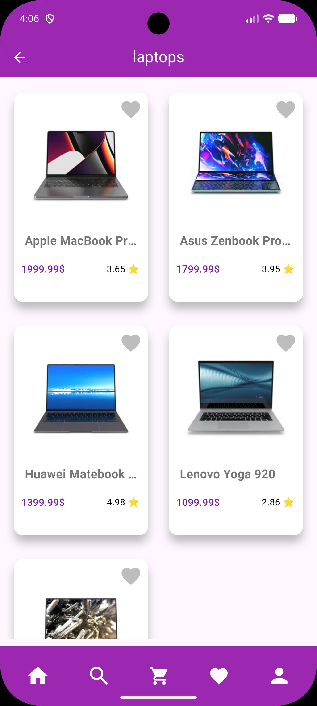

<<<<<<< Updated upstream
# 🛍️ Flux Store - Premium E-Commerce Mobile Application

<div align="center">

[](https://flutter.dev)
[](https://dart.dev)
[](LICENSE)
[](https://flutter.dev)

**A modern, high-performance e-commerce mobile solution with beautiful UI and seamless shopping experience**

[📱 Demo Video](#-demo) • [✨ Features](#-features) • [🚀 Getting Started](#-getting-started) • [📁 Project Structure](#-project-structure) • [👤 Author](#-author)

</div>

---

## 📱 Demo

<div align="center">

🎬 **[Watch Full Demo Video](https://youtube.com/shorts/PIg1rYA0CkQ)**

> Click the link above to see the app in action on YouTube Shorts

</div>

---

## 🎯 Overview

**Flux Store** is a production-ready e-commerce mobile application built with **Flutter** and **Dart**. It demonstrates modern app development practices with a focus on:

- 🎨 **Beautiful, Minimalist UI** - Clean Material Design with smooth animations
- ⚡ **Performance Optimized** - Fast product loading and responsive interactions
- 🏗️ **Clean Architecture** - Well-organized, maintainable code structure
- 🌐 **Real API Integration** - Fetches live product data from DummyJSON API
- 📱 **Cross-Platform** - Works seamlessly on Android and iOS devices

---

## ✨ Features

### Core Features
- **🏠 Home Screen** - Browse all products with a modern grid layout
- **📂 Categories** - Organize products by categories for easy navigation
- **🔍 Smart Search** - Fast and efficient product search with real-time results
- **📄 Product Details** - Comprehensive product information with images, price, and ratings
- **⭐ Reviews & Ratings** - See customer reviews and product ratings
- **❤️ Favorites** (Upcoming) - Save favorite products for later
- **🛒 Shopping Cart** (Coming Soon) - Add items to cart and checkout

### Technical Features
- **REST API Integration** - Real-time data from DummyJSON API
- **Error Handling** - Robust error management and user feedback
- **Responsive Design** - Fully responsive for all screen sizes
- **Material Design** - Google Material Design principles
- **Smooth Animations** - Professional transition effects

---

## 📸 Screenshots

<div align="center">

### Application Views

| Home Screen | Category Products | Product Details |
|:-:|:-:|:-:|
|  |  |  |
| Browse all products with beautiful grid layout | Filter products by selected category | View detailed product information with reviews |

| Search Products | Demo Video |
|:-:|:-:|
|  | [](https://youtube.com/shorts/PIg1rYA0CkQ) |
| Real-time search functionality | Click to watch full demo |

</div>

---

## 🛠️ Technical Stack

<div align="center">

| Technology | Purpose | Version |
|:-:|:-:|:-:|
| **Framework** | Flutter - Cross-platform UI | Stable |
| **Language** | Dart - Programming Language | 3.11.4+ |
| **Networking** | Dio - HTTP client | ^5.9.2 |
| **Architecture** | MVVM Pattern | Clean Code |
| **State Management** | Service-based | Simple & Effective |
| **Icons** | Font Awesome | ^11.0.0 |
| **API** | DummyJSON | Real Product Data |

</div>
=======
# Flux Store 🛍️

A professional, high-performance E-commerce mobile application developed with **Flutter**. The application demonstrates advanced API integration, dynamic data handling, and a clean user interface designed for a seamless shopping experience.

---

## 🚀 Key Features

* **Global Product Discovery**: Real-time fetching of products from a centralized REST API using optimized service layers.
* **Smart Category System**: Browse products by categories with dynamic filtering logic.
* **Advanced Search Functionality**: Search for specific categories and items with instant feedback and validation.
* **Interactive UI/UX**: Features custom-built components like dynamic category chips, smooth transitions, and a personalized `ServicesBar`.
* **In-depth Product Analytics**: View comprehensive product details including descriptions, pricing, real-time stock levels, and star ratings.
* **Social Proof Integration**: A dedicated reviews system to display user feedback and ratings for each product.

---

## 🛠️ Tech Stack & Architecture

* **Framework**: [Flutter](https://flutter.dev) (Dart)
* **Networking**: Robust REST API integration using a custom `Api` helper class for handled HTTP requests.
* **Architecture**: Follows a clean separation of concerns (SOC):
    * **Services**: Decoupled logic for data fetching (`AllProductsServices`, `CategoryListServices`, etc.).
    * **Models**: Strongly-typed data models for products and categories.
    * **Views**: Modular UI screens (`MainView`, `ProductView`, `CategorySearch`).
    * **Widgets**: Reusable components (`CustomTextField`, `CategoriesListBuilder`, `DetailsProductPart`).
* **State Management**: Optimized performance using reactive UI updates.

---

## 📸 App Preview

| Home Screen | Product Details | Search & Categories |
| :---: | :---: | :---: |
|  |  |  |

---

## ⚙️ Installation & Setup

Ensure you have the Flutter SDK installed on your machine.

1.  **Clone the repository**:
    ```bash
    git clone [https://github.com/ahmed-elbialy/flux_store.git](https://github.com/ahmed-elbialy/flux_store.git)
    ```
2.  **Install dependencies**:
    ```bash
    flutter pub get
    ```
3.  **Run the application**:
    ```bash
    flutter run
    ```
>>>>>>> Stashed changes

---

## 📁 Project Structure

<<<<<<< Updated upstream
```
lib/
├── main.dart                          # App entry point
├── Views/                             # Screen pages
│   ├── Main_View.dart                # Home screen - displays all products
│   ├── Category_Search.dart           # Category filter screen
│   ├── Category_Products.dart         # Products for selected category
│   └── Product_View.dart              # Product details page
├── Models/                            # Data models
│   ├── Product_Model.dart            # Product data structure
│   └── Reviews_Model.dart            # Review data structure (nested)
├── Services/                          # API service layer
│   ├── All_Product_Services.dart     # Fetch all products
│   ├── Category_List_Services.dart   # Fetch all categories
│   └── Category_Products_Services.dart # Fetch products by category
├── Widgets/                           # Reusable UI components
│   ├── Product_Card_Widget.dart      # Individual product card
│   ├── Products_List.dart            # Product list container
│   ├── Products_List_Builder.dart    # Product list with data binding
│   ├── CategoriesListBuilder.dart    # Categories list with data binding
│   ├── MainProductPart.dart          # Product image & main info
│   ├── DetilsProductPart.dart        # Product price & description
│   ├── Review_Card_Widget.dart       # Individual review card
│   ├── Reviews_List_Builder.dart     # Reviews list
│   ├── Custom_Text_Field.dart        # Search input field
│   └── ServicesBar.dart              # Bottom action bar
├── Constants/                         # App constants
│   └── Constants.dart                # API URLs, colors, configurations
├── helper/                            # Utility classes
│   └── API.dart                      # Dio HTTP client setup
├── android/                           # Android native code
├── ios/                              # iOS native code
└── pubspec.yaml                      # Dependencies & metadata
```

### Architecture Pattern: MVVM

```
View (UI Layer)
    ↓ (User Interaction)
ViewModel (Service Layer)
    ↓ (API Calls)
Model (Data Layer)
    ↓ (Response)
Back to View (Display)
```

---

## 🚀 Getting Started

### Prerequisites

Before you begin, ensure you have:
- **Flutter SDK** (Latest Stable Channel)
- **Dart SDK** (3.11.4 or higher)
- **Android Studio** or **Xcode** for mobile emulation
- **Git** for version control

### Installation Steps

#### 1️⃣ Clone the Repository
```bash
git clone https://github.com/ahmed-el-bialy/flux-store.git
cd flux-store
```

#### 2️⃣ Install Dependencies
```bash
flutter pub get
```

#### 3️⃣ Run the Application

**On Android Emulator or Device:**
```bash
flutter run
```

**On iOS Simulator or Device:**
```bash
flutter run -d ios
```

**On Web (if configured):**
```bash
flutter run -d chrome
```

---

## 📊 Data Flow Architecture

```
┌─────────────────────────────────────────────────┐
│         UI Layer (Views & Widgets)              │
│   (Main_View, Product_View, Category_Search)   │
└────────────────────┬────────────────────────────┘
                     │ (Build/Display)
                     ↓
┌─────────────────────────────────────────────────┐
│      Service Layer (Business Logic)             │
│  (AllProductsServices, CategoryServices, etc)   │
└────────────────────┬────────────────────────────┘
                     │ (HTTP Request)
                     ↓
┌─────────────────────────────────────────────────┐
│      Helper Layer (API & Utilities)             │
│              (Api, Constants)                   │
└────────────────────┬────────────────────────────┘
                     │ (Dio HTTP Request)
                     ↓
┌─────────────────────────────────────────────────┐
│      External API (DummyJSON)                   │
│   https://dummyjson.com/products                │
└─────────────────────────────────────────────────┘
```

---

## 🔗 API Endpoints

The app uses **DummyJSON** API for product data. Here are the main endpoints:

| Endpoint | Method | Purpose | Status |
|:-:|:-:|:-:|:-:|
| `/products` | GET | Get all products | ✅ Active |
| `/products/categories` | GET | Get all categories | ✅ Active |
| `/products/category/:name` | GET | Products by category | ✅ Active |
| `/products/search` | GET | Search products | ✅ Active |

### Example API Response (Product):
```json
{
  "id": 1,
  "title": "iPhone 9",
  "description": "An apple mobile which is very stylish...",
  "price": 549,
  "thumbnail": "https://cdn.dummyjson.com/products/images/smartphones/iphone-9.jpg",
  "rating": 4.3,
  "stock": 94,
  "reviews": [
    {
      "rating": 5,
      "comment": "Excellent product!",
      "date": "2024-04-15",
      "reviewerName": "Ahmed"
    }
  ]
}
```

---

## 🎨 UI/UX Highlights

### Design Elements
- **Color Scheme**: Purple Primary (#9C27B0) with Material Design guidelines
- **Typography**: Clean, readable fonts with proper hierarchy
- **Icons**: Font Awesome icons for intuitive navigation
- **Animations**: Smooth transitions and micro-interactions
- **Responsive**: Adapts beautifully to all screen sizes

### User Experience
- Intuitive navigation flow
- Fast loading times with optimized widgets
- Clear product information presentation
- Easy-to-use search functionality
- Accessible UI for all users

---

## 📱 User Flows

### 1. Browse Products
```
App Launch → Home Screen → View Products Grid → Scroll & Load More
```

### 2. View Product Details
```
Product Card → Tap Product → Product Details Screen → View Reviews
```

### 3. Search Products
```
Search Icon → Enter Query → Real-time Results → Tap Product
```

### 4. Filter by Category
```
Category Bar → Select Category → Category Products Screen → Browse
```

---

## 🔧 Key Dependencies

```yaml
dependencies:
  flutter:
    sdk: flutter
  
  # Networking
  dio: ^5.9.2                    # HTTP client for API calls
  
  # UI/Icons
  cupertino_icons: ^1.0.8        # iOS style icons
  font_awesome_flutter: ^11.0.0  # Font Awesome icons
  
  # Utilities
  intl: ^0.19.0                  # Internationalization
```

---

## 🚧 Future Enhancements

Planned features for upcoming releases:

- [ ] **Shopping Cart** - Add items to cart and manage quantity
- [ ] **User Authentication** - Login/Signup with secure authentication
- [ ] **Order Management** - View order history and tracking
- [ ] **Payment Integration** - Stripe/PayPal payment gateway
- [ ] **Favorites** - Save products to favorites list
- [ ] **Reviews Submission** - Allow users to write reviews
- [ ] **Advanced Filters** - Filter by price range, rating, availability
- [ ] **Dark Mode** - Dark theme support
- [ ] **Multi-language** - Arabic, English, and more languages
- [ ] **Offline Support** - Cache products for offline browsing
- [ ] **Notifications** - Push notifications for deals and updates
- [ ] **Social Sharing** - Share products on social media

---

## 🐛 Known Issues & Limitations

### Current Limitations
- ⚠️ No persistent storage (local database)
- ⚠️ Shopping cart not yet implemented
- ⚠️ No user authentication system
- ⚠️ Demo API data only (no real transactions)
- ⚠️ Limited error messages in some screens

### Known Issues
- None reported yet! 🎉

---

## 📝 Code Standards & Best Practices

### Naming Conventions
- **Classes**: PascalCase (e.g., `ProductModel`, `MainView`)
- **Variables**: camelCase (e.g., `productList`, `isLoading`)
- **Constants**: camelCase with `k` prefix (e.g., `kMainColor`)
- **Files**: Snake_case (e.g., `main_view.dart`, `product_model.dart`)

### Code Organization
- Each widget in separate file for maintainability
- Services handle all API calls
- Models define data structures
- Views are stateless when possible

### Comments & Documentation
- Comments explain the "why", not the "what"
- Public methods have documentation comments
- Complex logic is commented for clarity

---

## 🤝 Contributing

Contributions are welcome! Here's how you can help:

### How to Contribute
1. **Fork** the repository
2. **Create** a new feature branch (`git checkout -b feature/amazing-feature`)
3. **Commit** your changes (`git commit -m 'Add some amazing feature'`)
4. **Push** to the branch (`git push origin feature/amazing-feature`)
5. **Open** a Pull Request

### Contribution Guidelines
- Follow the code standards mentioned above
- Write meaningful commit messages
- Test your changes before submitting PR
- Include screenshots for UI changes
- Update README if adding new features

---

## 📄 License

This project is licensed under the **MIT License** - see the [LICENSE](LICENSE) file for details.

---

## 👤 Author & Contact

**Ahmed El-Bialy**

Your dedicated full-stack mobile developer specializing in Flutter applications.

### Connect With Me

<div align="center">

[](https://www.linkedin.com/in/ahmedel-bialy/)
[](mailto:ah.elbialy.dev@gmail.com)
[](tel:+201022121573)

**📧 Email:** ah.elbialy.dev@gmail.com  
**📞 Phone:** +20 102 2121 573  
**🔗 LinkedIn:** [Ahmed El-Bialy](https://www.linkedin.com/in/ahmedel-bialy/)

</div>

---

## 🎓 Learning Resources

Useful resources if you want to learn about Flutter and this project:

- [Flutter Documentation](https://flutter.dev/docs)
- [Dart Documentation](https://dart.dev/guides)
- [Material Design Guidelines](https://material.io/design)
- [DummyJSON API Documentation](https://dummyjson.com)
- [Flutter Best Practices](https://flutter.dev/docs/testing/best-practices)

---

## ⭐ Show Your Support

If you found this project helpful, please consider:

- ⭐ Starring this repository
- 🔗 Sharing it with other Flutter developers
- 💬 Providing feedback and suggestions
- 🐛 Reporting any issues you find

---

<div align="center">

### Built with ❤️ by Ahmed El-Bialy

*Last updated: April 2026*

[](https://github.com/ahmed-el-bialy/flux-store)
[](https://github.com/ahmed-el-bialy/flux-store/fork)

</div>
=======
```text
lib/
├── Constants/    # Global themes and app constants
├── Models/       # JSON-to-Dart data models
├── Services/     # API interaction and logic layer
├── Views/        # UI screens and navigation
├── Widgets/      # Reusable and modular UI elements
└── helper/       # Networking and utility helpers

👨‍💻 Contact & Professional Profile
Ahmed El-Bialy AI Student & Flutter Mobile Developer

LinkedIn: linkedin.com/in/ahmedel-bialy

Email: ah.elbialy.dev@gmail.com

Phone: +201022121573

Built with passion and a commitment to clean code standards.
>>>>>>> Stashed changes
