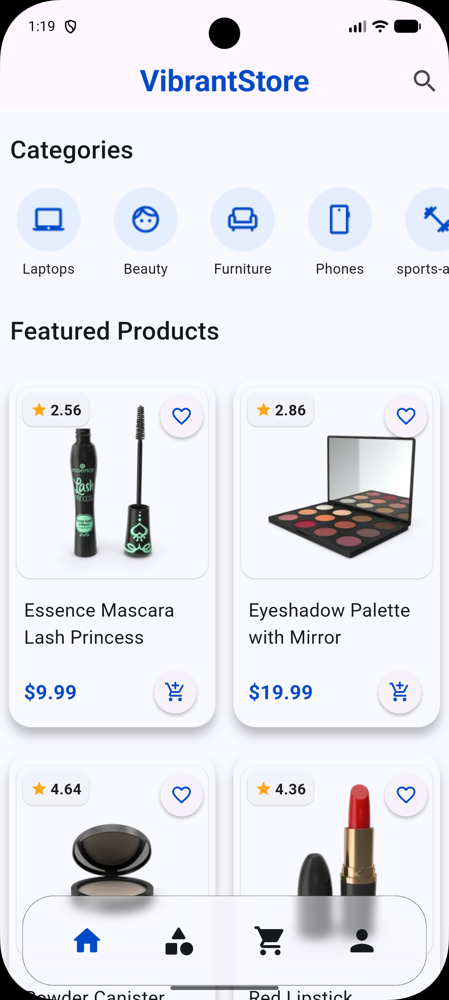
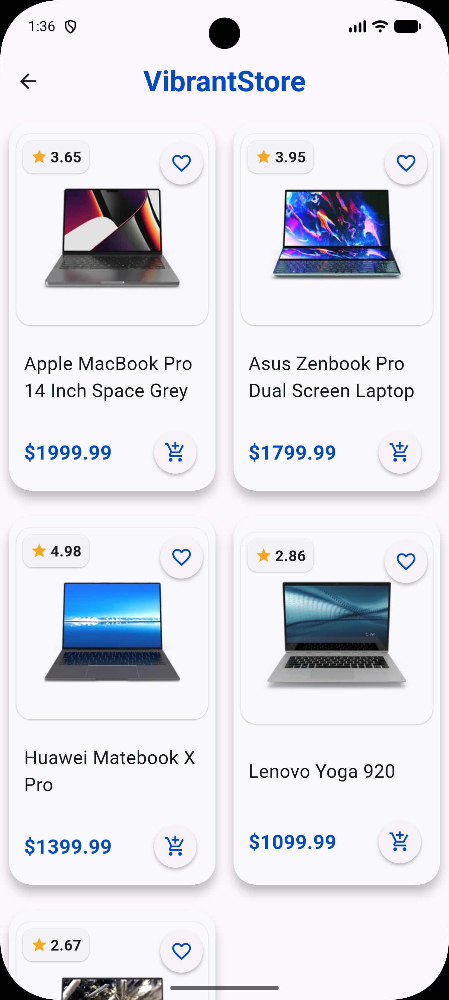
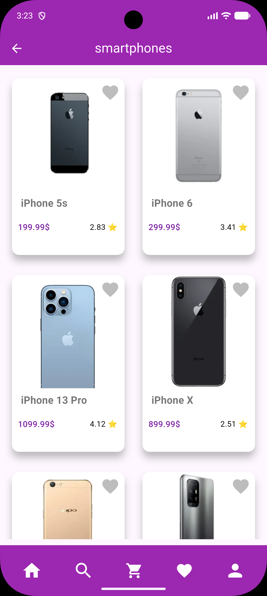
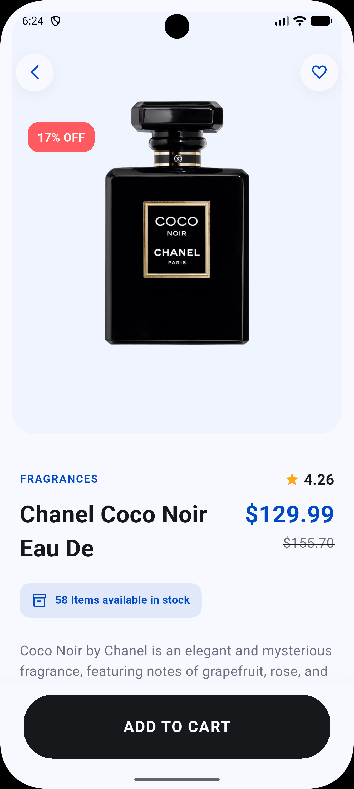
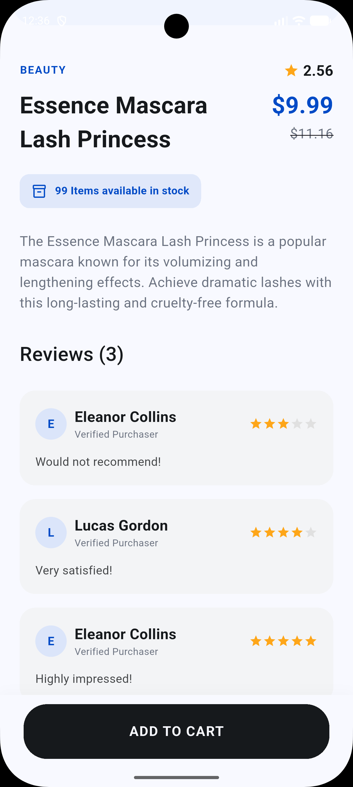

<div align="center">

# 🛍️ Flux Store

[](https://flutter.dev)
[](https://dart.dev)
[](LICENSE)
[](https://flutter.dev)

**A modern, high-performance e-commerce mobile solution with beautiful UI and seamless shopping experience**

[📱 Demo Video](#-demo-video) • [✨ Features](#-features) • [📸 Screenshots](#-screenshots) • [🏗️ Architecture](#%EF%B8%8F-architecture) • [🚀 Getting Started](#-getting-started) • [👤 Author](#-author)

</div>

---

## 📱 Demo Video

<div align="center">

### 🎬 Watch the App in Action

**[🔗 Watch on YouTube Shorts](https://youtube.com/shorts/PIg1rYA0CkQ)** | **[📥 Download Video](screenshots/Overview.mp4)**

*A complete walkthrough of Flux Store demonstrating all core features and functionality*

</div>

---

## 🎯 Overview

**Flux Store** is a modern Flutter e-commerce application demonstrating clean architecture, real-time API integration, and responsive UI design. Built as a portfolio showcase for mobile development best practices.

### 💡 Key Highlights
- 🎨 **Beautiful, Minimalist UI** — Clean Material Design with smooth interactions
- ⚡ **Performance Optimized** — Fast product loading with `GridView.builder`
- 🏗️ **Clean Architecture** — Well-organized layered code structure
- 🌐 **Real API Integration** — Live product data from DummyJSON API
- 📱 **Cross-Platform** — Works seamlessly on Android and iOS
- 🛡️ **Error Handling** — User-friendly error states and loading indicators

---

## ✨ Features

### 🏠 Core Features
- **Home Screen** — Browse all products with a modern 2-column grid layout
- **Product Categories** — Organize and filter products by categories
- **Smart Search** — Real-time category search with chips and text input
- **Product Details** — Comprehensive info with images, price, stock & ratings
- **Customer Reviews** — Detailed reviews with star ratings and dates
- **Favorites System** — Toggle favorite products *(in-memory, non-persisted)*

### ⚙️ Technical Features
- **REST API Integration** — Real-time data from DummyJSON with Dio HTTP client
- **Robust Error Handling** — Comprehensive error management and user feedback
- **Responsive Design** — Fully responsive for all screen sizes
- **Material Design 3** — Latest Google Material Design principles
- **Service-based Architecture** — Clean separation with dedicated Service Layer

---

## 📸 Screenshots

<div align="center">

| 🏠 Home | 🔍 Search | 📂 Category |
|:-------:|:---------:|:-----------:|
|  |  |  |
| Browse all products | Search by category | Filtered products |

| 📦 Product Details | ⭐ Reviews |
|:------------------:|:----------:|
|  |  |
| Price, stock, description | Customer ratings & comments |

</div>

---

## 🛠️ Technical Stack

<div align="center">

| Component | Technology | Version | Purpose |
|:---------:|:----------:|:-------:|:-------:|
| **Framework** | Flutter | Stable | Cross-platform UI |
| **Language** | Dart | 3.x | Programming |
| **HTTP Client** | Dio | ^5.x | API communication |
| **State Mgmt** | setState | Built-in | UI state handling |
| **Icons** | Font Awesome | ^10.x | Icon library |
| **API** | DummyJSON | Live | Product data |
| **Design** | Material Design 3 | Latest | UI/UX guidelines |

</div>

---

## 🏗️ Architecture

### 📁 Project Structure

```
lib/
├── main.dart                              # Application entry point
│
├── Views/                                 # 🎬 UI Screens
│   ├── Main_View.dart                    # Home screen — product grid
│   ├── Category_Search.dart              # Category selection & search
│   ├── Category_Products.dart            # Products filtered by category
│   └── Product_View.dart                 # Detailed product info
│
├── Models/                                # 📊 Data Models
│   ├── Product_Model.dart                # Product + Reviews parsing
│   └── Category_Model.dart               # Category data structure
│
├── Services/                              # 🔌 API Service Layer
│   ├── All_Product_Services.dart         # GET /products
│   ├── Category_List_Services.dart         # GET /products/categories
│   └── Category_Products_Services.dart   # GET /products/category/{name}
│
├── Widgets/                               # 🧩 Reusable UI Components
│   ├── Product_Card_Widget.dart          # Individual product card
│   ├── Products_List_Builder.dart        # FutureBuilder grid
│   ├── CategoriesListBuilder.dart        # Category chips list
│   ├── MainProductPart.dart              # Product image & info
│   ├── DetilsProductPart.dart            # Price & description
│   ├── Reviews_List_Builder.dart         # Reviews list
│   ├── Custom_Text_Field.dart            # Search input
│   └── ServicesBar.dart                  # Bottom navigation bar
│
├── Constants/                             # ⚙️ App Configuration
│   └── Constants.dart                    # API URL, theme color
│
└── helper/                                # 🔧 Utilities
    ├── API.dart                          # Dio HTTP wrapper
    └── Data_Formater.dart                # Date formatting (intl)
```

### 🔄 Data Flow

```
┌─────────────┐     ┌─────────────┐     ┌─────────────┐     ┌─────────────┐
│   Views     │────▶│  Services   │────▶│   Helper    │────▶│  DummyJSON  │
│  (Widgets)  │◀────│  (API Call) │◀────│   (Dio)     │◀────│    API      │
└─────────────┘     └─────────────┘     └─────────────┘     └─────────────┘
      │
      ▼
┌─────────────┐
│   Models    │
│ (fromJson)  │
└─────────────┘
```

**Routing:** Static ID pattern for type-safe navigation
```dart
// Route identifier
static String id = "Home View";

// Navigation
Navigator.pushNamed(context, ProductView.id, arguments: productModel);
```

---

## 🌐 API Integration

**Base URL:** `https://dummyjson.com/products`

| Endpoint | Method | Service Class | Response |
|:---------|:------:|:--------------|:---------|
| `/products` | `GET` | `AllProductsServices` | `List<ProductModel>` |
| `/products/categories` | `GET` | `CategoryListServices` | `List<CategoryModel>` |
| `/products/category/{name}` | `GET` | `CategoryProductsServices` | `List<ProductModel>` |

**HTTP Client:** Custom Dio wrapper with JSON parsing and error interception.

**Example Response:**
```json
{
  "id": 1,
  "title": "iPhone 9",
  "price": 549,
  "rating": 4.3,
  "stock": 94,
  "thumbnail": "https://cdn.dummyjson.com/...",
  "reviews": [
    {
      "rating": 5,
      "comment": "Excellent product!",
      "date": "2024-04-15",
      "reviewerName": "Ahmed El-Bialy"
    }
  ]
}
```

---

## 🧩 Data Models

### ProductModel
```dart
class ProductModel {
  final String image;           // Product thumbnail URL
  final String title;           // Product name
  final dynamic price;          // Price (raw from API)
  final double rate;            // Average rating (0-5)
  final int stock;              // Available quantity
  final String description;     // Product details
  final List<ReviewsModel> reviews;  // Customer reviews
  bool isFav = false;           // Local favorite state (non-persisted)
}
```

### ReviewsModel
```dart
class ReviewsModel {
  final int rating;             // Individual rating (1-5)
  final String comment;         // Review text
  final String date;            // ISO 8601 date string
  final String reviewerName;    // Customer name
}
```

**Defensive Parsing:**
```dart
factory ReviewsModel.fromJson(jsonData) => ReviewsModel(
  rating: jsonData["rating"] ?? 0,
  comment: jsonData["comment"] ?? "No comment provided",
  date: jsonData["date"] ?? "Unknown date",
  reviewerName: jsonData["reviewerName"] ?? "Anonymous",
);
```

---

## 📦 Dependencies

```yaml
dependencies:
  flutter:
    sdk: flutter
  dio: ^5.x.x              # HTTP client with interceptors
  intl: ^0.x.x             # Date formatting
  font_awesome_flutter: ^10.x.x  # Icon library
```

```bash
flutter pub get
```

---

## 🚀 Getting Started

### 📋 Prerequisites

| Requirement | Version | Purpose |
|:-----------:|:-------:|:-------:|
| Flutter SDK | >=3.0.0 | Framework |
| Dart SDK | >=3.0.0 | Language |
| Android Studio / Xcode | Latest | Emulators |
| Git | Latest | Version control |

### 💻 Installation

```bash
# 1. Clone repository
git clone https://github.com/ahmed-el-bialy/flux-store.git
cd flux-store

# 2. Install dependencies
flutter pub get

# 3. Run application
flutter run

# Build for production
flutter build apk --release      # Android APK
flutter build appbundle --release # Android AAB
flutter build ios --release       # iOS
```

---

## 🎨 Design System

### Color Palette
- **Primary:** `#9C27B0` (Purple) — Brand color, AppBar, buttons
- **Background:** `#FFFFFF` (White) — Clean, minimal aesthetic
- **Surface:** `#F5F5F5` (Light Gray) — Card backgrounds
- **Text Primary:** `#212121` (Dark Gray) — Main text
- **Text Secondary:** `#757575` (Medium Gray) — Secondary text

### Typography
- **Font:** System default (Roboto / San Francisco)
- **Headlines:** Bold, 24-32pt
- **Body:** Regular, 14-16pt
- **Captions:** Regular, 12pt

---

## ⚠️ Known Limitations

| Issue | Details | Status |
|:------|:--------|:------:|
| Favorites not persisted | `isFav` resets on app restart | 🔧 Planned |
| Cart not implemented | Button exists in UI only | 🔧 Planned |
| No pagination | All products load at once | 🔧 Planned |
| Manual JSON parsing | No code generation | ✅ By design |

---

## 🔮 Roadmap

- [ ] **Persist favorites** with Hive or SharedPreferences
- [ ] **Implement cart** with quantity management
- [ ] **Add product search** by name
- [ ] **User authentication** with profiles
- [ ] **Offline caching** with Dio interceptors
- [ ] **State management** migration (Provider / Riverpod)
- [ ] **Widget & unit tests**
- [ ] **CI/CD** with GitHub Actions

---

## 🤝 Contributing

Contributions are welcome!

1. **Fork** the repository
2. **Create** a feature branch: `git checkout -b feature/amazing-feature`
3. **Commit** changes: `git commit -m 'feat: Add amazing feature'`
4. **Push** to branch: `git push origin feature/amazing-feature`
5. **Open** a Pull Request

---

## 📄 License

This project is licensed under the **MIT License** — see the [LICENSE](LICENSE) file for details.

---

## 👤 Author

**Ahmed El-Bialy**  
*Flutter Developer | Mobile App Specialist*

<div align="center">

[](https://www.linkedin.com/in/ahmedel-bialy/)
[](mailto:ah.elbialy.dev@gmail.com)
[](tel:+201022121573)
[](https://github.com/ahmed-el-bialy)

</div>

📧 **Email:** ah.elbialy.dev@gmail.com  
📞 **Phone:** +20 102 212 1573

---

<div align="center">

### ⭐ Star this repo if you found it helpful!

**Built with ❤️ by Ahmed El-Bialy**

</div>
